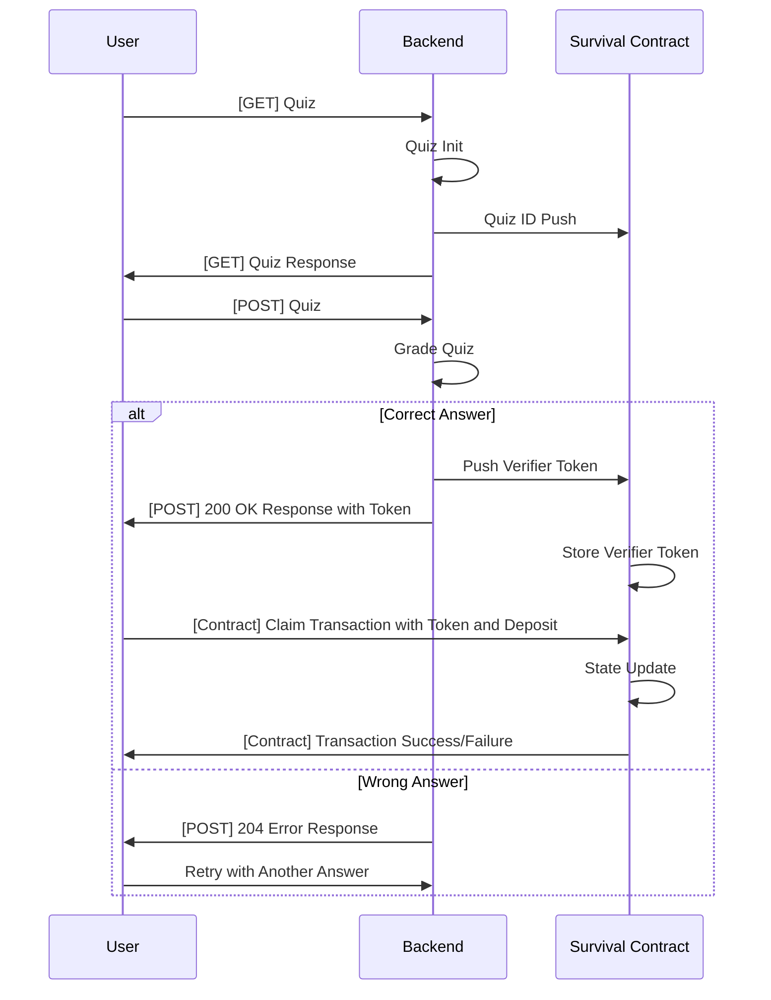

# starknet-timebomb-smart-contract
Smart Contract for Timebomb Quiz and Answer Generator

## Declear
```shell
starkli declare target/dev/timebomb_SurvivalGame.contract_class.json --rpc http://127.0.0.1:5050 --account ~/account.json --keystore ~/keystore.json
```

## Deploy

```shell
starkli deploy \
  --rpc http://127.0.0.1:5050 \
  --account ~/account.json \
  --keystore ~/keystore.json \
  0x04c027584e5bfda894badef49ff99754521eba6e201cf4c07c5a479ab1a52671 \
  0x034ba56f92265f0868c57d3fe72ecab144fc96f97954bbbc4252cef8e8a979ba \
  0x02939f2dc3f80cc7d620e8a86f2e69c1e187b7ff44b74056647368b5c49dc370 \
  0x034ba56f92265f0868c57d3fe72ecab144fc96f97954bbbc4252cef8e8a979ba \
  500
```

## Flow

